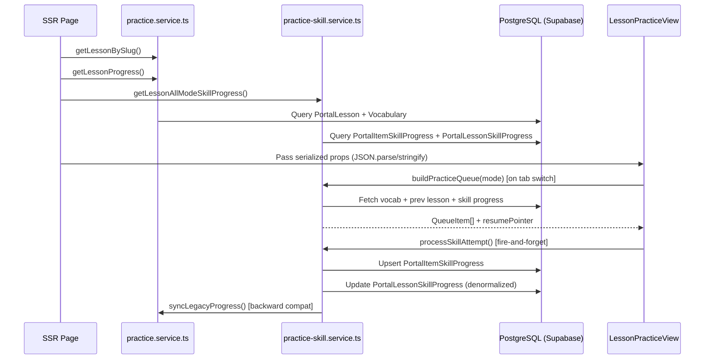

# 🎯 Practice Module & AI Integration — Improvement Plan

> **Project:** Ruby HSK Portal
> **Date Created:** 2026-03-10
> **Scope:** Practice Module, AI Chatbot, Student Dashboard, Progress Page
> **Breakpoints:** Mobile-first ≤425px · Tablet 768–1279px · Desktop ≥1280px
> **AI Strategy:** DeepSeek (primary) + A/B test infrastructure

---

## Table of Contents

1. [Current State Audit](#1-current-state-audit)
2. [Pain Points & Technical Debt](#2-pain-points--technical-debt)
3. [Phase 1 — Quick Wins](#3-phase-1--quick-wins)
4. [Phase 2 — AI Deep Integration](#4-phase-2--ai-deep-integration)
5. [Phase 3 — Advanced Features (Outline)](#5-phase-3--advanced-features-outline)
6. [Breakpoint Strategy](#6-breakpoint-strategy)
7. [Appendix](#7-appendix)

---

## 1. Current State Audit

### 1.1 Practice Module Architecture

```
SSR Page (auth guard + data fetch)
  └─► LessonPracticeView (client component, orchestrator)
        ├─► ProgressCard (mastery circle + per-mode badges)
        ├─► Tabs (HeroUI)
        │     ├─► LookupTab          (static, no queue)
        │     ├─► FlashcardTab       (dynamic import, ssr:false)
        │     ├─► QuizTab            (dynamic import, ssr:false)
        │     ├─► ListenTab          (dynamic import, ssr:false)
        │     └─► WriteTab           (dynamic import, ssr:false)
        └─► Sibling Lesson Navigation
```

**Data Flow:**



---

### 1.2 Component Map

| Component | File | Role |
|-----------|------|------|
| `PracticeListView` | `components/portal/practice/PracticeListView.tsx` | Lesson list by course, overall stats |
| `PracticeCourseAccordion` | `components/portal/practice/PracticeCourseAccordion.tsx` | Accordion group lessons by course |
| `PracticeLessonItem` | `components/portal/practice/PracticeLessonItem.tsx` | Single lesson row + skill badges |
| `LessonPracticeView` | `components/portal/practice/LessonPracticeView.tsx` | Orchestrator: 5 tabs, queue state, progress refresh |
| `ProgressCard` | `components/portal/practice/ProgressCard.tsx` | Mastery circle SVG + 4-mode skill grid |
| `LookupTab` | `components/portal/practice/tabs/LookupTab.tsx` | Vocabulary lookup, search/filter, detail drawer |
| `FlashcardTab` | `components/portal/practice/tabs/FlashcardTab.tsx` | Card flip, HARD/GOOD/EASY, review unknowns |
| `QuizTab` | `components/portal/practice/tabs/QuizTab.tsx` | MCQ (4 question types), auto-advance, retry wrong |
| `ListenTab` | `components/portal/practice/tabs/ListenTab.tsx` | Audio-first, transcript toggle, MCQ meanings |
| `WriteTab` | `components/portal/practice/tabs/WriteTab.tsx` | 3 sub-modes: Animation, Stroke Practice, Type Pinyin |
| `QuizResultScreen` | `components/portal/practice/shared/QuizResultScreen.tsx` | Quiz results + retry/next actions |

---

### 1.3 Progress System (Dual)

| System | Models | Description | Status |
|--------|--------|-------------|--------|
| **Legacy** | `PortalLessonProgress` + `PortalItemProgress` | Aggregated mastery, no mode distinction | ⚠️ Needs deprecation |
| **Skill-based** | `PortalItemSkillProgress` + `PortalLessonSkillProgress` | Per-vocab × per-mode (F/Q/L/W) | ✅ Active |
| **Session** | `PortalLessonSessionState` | Resume pointer per student × lesson × mode | ✅ Active |

**Mastery Scoring:**

| Mode | Correct Δ | Wrong Δ | Notes |
|------|-----------|---------|-------|
| FLASHCARD | +0.15 (GOOD) | −0.10 (HARD) | EASY = +0.20 |
| QUIZ | +0.20 | −0.15 | — |
| LISTEN | +0.15 | −0.10 | — |
| WRITE | +0.25 | −0.10 | Highest reward |

**Status transitions:** `NOT_STARTED` → `LEARNING` (score > 0) → `MASTERED` (score ≥ 0.8)

---

### 1.4 Queue Building & Interleaving

Logic in `services/portal/practice-skill.service.ts` → `buildPracticeQueue()`:

1. Fetch current lesson vocab (ordered by `order`)
2. Find previous lesson (same course, lower order)
3. Fetch previous lesson vocab
4. Batch-fetch `PortalItemSkillProgress` for all vocab IDs
5. Select up to N=5 prev-lesson vocab — priority: not mastered → due for review → random
6. **Interleave:** inject 1 prev-lesson vocab every 3 current vocab
7. Upsert `PortalLessonSessionState` for resume tracking
8. Resume pointer: find first non-MASTERED vocab from `lastPosition`, wrap-around if needed

---

### 1.5 AI Chatbot — Current State

| Aspect | Detail |
|--------|--------|
| **Model** | DeepSeek (`deepseek-chat`) via OpenAI-compatible API |
| **File** | `lib/ai/chat-service.ts` |
| **System prompt** | Chinese teacher persona — explains grammar, corrects sentences, always includes pinyin |
| **RAG** | Searches `Vocabulary` table (word/meaning/pinyin), top 5 results → injected as context |
| **Context window** | 20 most recent messages from session |
| **Streaming** | SSE-based, delta parsing |
| **Rate limit** | 30 msg/min/user |
| **UI** | `components/portal/chat/AIChatbot.tsx` — floating bubble 380×680px |
| **Practice integration** | ❌ None — chatbot runs independently |

---

## 2. Pain Points & Technical Debt

### 2.1 UX Pain Points

| # | Issue | Severity | Related File(s) |
|---|-------|----------|-----------------|
| U1 | **StudentDashboard 100% hardcoded** — stats, upcoming classes, assignments, vocabulary, progress bars are all static data | 🔴 Critical | `components/portal/dashboards/StudentDashboard.tsx` |
| U2 | **Progress page is placeholder only** — displays "Under Development" | 🔴 Critical | `app/(portal)/portal/[role]/progress/page.tsx` |
| U3 | **No guided learning path** — students enter the lesson list with no indication of what to study next | 🟡 High | `PracticeListView.tsx` |
| U4 | **Flashcard client state desync** — `knownSet`/`unknownSet` tracking does not map correctly to server mastery score; review phase does not update server queue pointer | 🟡 High | `FlashcardTab.tsx` |
| U5 | **WriteTab shuffle override** — client `shuffleArray()` on mount overwrites server queue interleaving | 🟡 High | `WriteTab.tsx` |
| U6 | **No keyboard shortcuts** — no Space to flip flashcard, no 1–4 to select quiz answer, no Enter to advance | 🟡 High | All tabs |
| U7 | **Tab switch re-fetches queue** — every tab switch calls `buildPracticeQueue` again, losing client progress | 🟠 Medium | `LessonPracticeView.tsx` |
| U8 | **AI chatbot unaware of practice context** — student is practicing lesson X, but chatbot has no knowledge of the current vocabulary | 🟡 High | `lib/ai/chat-service.ts` |
| U9 | **AIChatbot not responsive on mobile** — fixed 380×680px overflows on phones ≤425px | 🟠 Medium | `AIChatbot.tsx` |
| U10 | **Quiz is MCQ-only** — all 4 question types are multiple choice; missing fill-in-blank and matching | 🟠 Medium | `QuizTab.tsx` |

---

### 2.2 Technical Debt

| # | Issue | Severity | Related File(s) |
|---|-------|----------|-----------------|
| T1 | **`JSON.parse(JSON.stringify())`** serialization in SSR pages — loses Date types, wastes memory | 🟡 High | `app/(portal)/portal/[role]/practice/[level]/[lessonSlug]/page.tsx` |
| T2 | **Dual progress system** — legacy `PortalLessonProgress` + new `PortalItemSkillProgress` sync overhead | 🟡 High | `practice-skill.service.ts`, `practice.service.ts` |
| T3 | **`nextReviewAt` stored but unused** — field exists in DB; `buildPracticeQueue` does not filter by review date | 🟡 High | `practice-skill.service.ts` |
| T4 | **No error boundary per tab** — a crash in hanzi-writer (WriteTab) blanks the entire practice view | 🟠 Medium | All tabs |
| T5 | **No pagination in `PracticeListView`** — 6 HSK levels × ~25 lessons = ~150 rows rendered simultaneously | 🟠 Medium | `PracticeListView.tsx` |
| T6 | **`useMemo` key in QuizTab** contains `generationKey` that changes on every restart → regenerates all questions | 🟠 Medium | `QuizTab.tsx` |
| T7 | **Duplicate session start/finish logic** — both `practice.service.ts` and `practice-skill.service.ts` have session wrappers | 🟢 Low | Both service files |
| T8 | **Audio relies solely on Web Speech API** — quality depends on device/browser; unreliable on some mobile browsers | 🟠 Medium | `hooks/useSpeech.ts` |

---

## 3. Phase 1 — Quick Wins

> **Estimated timeline:** 2–3 weeks
> **Goal:** Fix critical issues, improve baseline UX, clear technical debt

---

### [P1-01] Fix StudentDashboard — Real Data Bindings

**Description:** Replace all hardcoded data in `StudentDashboard` with real data from the database.

**Files to modify:**
- `app/(portal)/portal/[role]/page.tsx` — add server-side data fetching
- `components/portal/dashboards/StudentDashboard.tsx` — accept props instead of hardcoding

**Details:**
- **Stats grid:** query `PortalItemSkillProgress` (words learned), `PortalLessonProgress` (completed lessons), `PortalAssignment` (pending count)
- **"Continue learning" banner:** query `PortalLessonSessionState` for last active lesson + mode
- **Upcoming classes:** query `PortalSchedule` WHERE `date >= now`, limit 3
- **Pending assignments:** query `PortalAssignment` WHERE `status = PENDING`, limit 3
- **Recent vocabulary:** query `PortalItemProgress` ORDER BY `updatedAt DESC`, limit 5
- **Learning progress:** query `PortalLessonSkillProgress` grouped by course

**Acceptance Criteria:**
- [ ] All sections display real data
- [ ] Loading skeleton shown during fetch
- [ ] Empty state shown when no data exists
- [ ] "Continue learning" link navigates to the correct lesson + tab

---

### [P1-02] Keyboard Shortcuts for Practice Tabs

**Description:** Add keyboard interaction to all practice tabs.

**Files to modify:**
- `hooks/usePracticeKeyboard.ts` — create new custom hook
- `components/portal/practice/tabs/FlashcardTab.tsx` — `Space`: flip · `←`: HARD · `↓`: GOOD · `→`: EASY
- `components/portal/practice/tabs/QuizTab.tsx` — `1/2/3/4`: select answer · `Enter`: next
- `components/portal/practice/tabs/ListenTab.tsx` — `Space`: play audio · `1/2/3/4`: select answer
- `components/portal/practice/tabs/WriteTab.tsx` — `Enter`: submit pinyin

**Details:**
- Custom hook `usePracticeKeyboard(keymap, enabled)` accepts a keymap config
- `useEffect` listens for `keydown`, cleaned up on unmount
- Only active when the tab has focus (no conflict with chatbot input)
- Small keyboard hint displayed below each action button (muted text, hidden on mobile ≤425px)

**Acceptance Criteria:**
- [ ] Space flips flashcard; arrow keys select difficulty
- [ ] Number keys select quiz answers
- [ ] Hints visible on desktop ≥1280px, hidden on mobile
- [ ] No conflict when user is typing in search or chatbot

---

### [P1-03] Error Boundaries per Practice Tab

**Description:** Wrap each tab in an Error Boundary so a crash in one tab does not affect the rest of the view.

**Files to create/modify:**
- Create `components/portal/practice/shared/TabErrorBoundary.tsx`
- `components/portal/practice/LessonPracticeView.tsx` — wrap each tab's content

**Details:**
- React Error Boundary class component (React 19 compatible)
- Displays: error icon + "An error occurred" message + "Retry" button (resets state)
- Logs error to console
- Tab bar remains functional

**Acceptance Criteria:**
- [ ] A crash in WriteTab (hanzi-writer) does not blank the entire page
- [ ] "Retry" button resets error state and re-renders the tab
- [ ] Tab bar remains usable when one tab errors

---

### [P1-04] Refactor Serialization — Remove `JSON.parse(JSON.stringify())`

**Description:** Replace `JSON.parse(JSON.stringify(data))` with a proper date-serialization helper.

**Files to modify:**
- `app/(portal)/portal/[role]/practice/[level]/[lessonSlug]/page.tsx`
- `utils/serialize.ts` — create new utility

**Details:**
- Create `serializeDates<T>(obj: T): T` — recursive converter: `Date` → ISO string
- Zero dependencies, fully type-safe
- Replace all 5 instances in the practice detail page

**Acceptance Criteria:**
- [ ] No more `JSON.parse(JSON.stringify())` in practice pages
- [ ] Date fields serialize/deserialize correctly
- [ ] No increase in bundle size

---

### [P1-05] AIChatbot — Mobile-First Responsive Layout

**Description:** Make the chatbot responsive: full-screen on ≤425px, compact panel on 426–1279px, full panel on ≥1280px.

**Files to modify:**
- `components/portal/chat/AIChatbot.tsx`

**Details:**
- **≤425px:** full-screen overlay (`fixed inset-0`, `z-50`) with close button in header
- **426–1279px:** panel 340×600px, anchored bottom-right
- **≥1280px:** panel 380×680px (current behavior)
- Touch targets min 44×44px; smooth open/close transition

**Acceptance Criteria:**
- [ ] Full-screen overlay on phones ≤425px
- [ ] Panel not clipped on tablet
- [ ] Smooth transition on open/close
- [ ] Input not obscured by the soft keyboard on mobile

---

### [P1-06] Unify Dual Progress System

**Description:** Deprecate the legacy progress system; migrate fully to the skill-based system.

**Files to modify:**
- `services/portal/practice-skill.service.ts` — remove `syncLegacyProgress()` calls
- `services/portal/practice.service.ts` — migrate read queries
- `components/portal/practice/PracticeListView.tsx` — read from skill-based tables
- `components/portal/practice/PracticeLessonItem.tsx` — mastery from skill average

**Details:**
- Overall mastery = average of (FLASHCARD, QUIZ, LISTEN, WRITE) scores
- Update list-view stats + lesson item progress bars
- Remove all `syncLegacyProgress()` calls
- Soft-deprecate legacy tables (do not drop)

**Acceptance Criteria:**
- [ ] Stats derived correctly from skill-based data
- [ ] Progress bars reflect average skill mastery
- [ ] No remaining calls to `syncLegacyProgress()`

---

### [P1-07] Fix Flashcard State Sync

**Description:** Synchronize Flashcard client state with server skill progress.

**Files to modify:**
- `components/portal/practice/tabs/FlashcardTab.tsx`

**Details:**
- HARD → add to `unknownSet` + submit server wrong attempt
- GOOD/EASY → add to `knownSet` + submit server correct attempt
- On resume: start from the correct saved position (`initialPointer`)
- On session end: reset pointer

**Acceptance Criteria:**
- [ ] Client state in sync with server mastery
- [ ] Resume works correctly
- [ ] Session end resets pointer

---

### [P1-08] Fix WriteTab Queue Override

**Description:** Prevent WriteTab from shuffling the queue; preserve server interleaving order.

**Files to modify:**
- `components/portal/practice/tabs/WriteTab.tsx`

**Details:**
- Remove `shuffleArray()` call on mount
- Use `modeQueue` (already interleaved) instead of raw `vocabularies`
- Optional shuffle toggle, default `OFF`

**Acceptance Criteria:**
- [ ] Default: server queue order (interleaved)
- [ ] Optional shuffle toggle available
- [ ] Resume pointer works correctly

---

### [P1-09] Pagination for PracticeListView

**Description:** Implement lazy loading for the lesson list.

**Files to modify:**
- `components/portal/practice/PracticeListView.tsx`
- `components/portal/practice/PracticeCourseAccordion.tsx`

**Details:**
- Accordions collapsed by default; only the active course expands automatically
- Skill badges fetched on-demand when an accordion expands
- No loading flash for already-fetched courses

**Acceptance Criteria:**
- [ ] Initial render shows only course headers + active course expanded
- [ ] Data fetched on-demand on expand
- [ ] No loading flash for previously fetched courses

---

### [P1-10] Guided Learning Path — "Continue Learning"

**Description:** Add a "Continue Learning" banner at the top of `PracticeListView`.

**Files to modify:**
- `components/portal/practice/PracticeListView.tsx`
- `services/portal/practice-skill.service.ts` — add `getLastActiveLesson()`

**Details:**
- Query `PortalLessonSessionState` ORDER BY `updatedAt DESC`, LIMIT 1
- Card displays: `"Continue: [Lesson Name] — [Mode] — [X/Y words mastered]"`
- First-time user: suggest the first lesson

**Acceptance Criteria:**
- [ ] Banner shows the correct lesson + mode in progress
- [ ] Click navigates to the correct URL
- [ ] First-time user sees a lesson suggestion

---

## 4. Phase 2 — AI Deep Integration

> **Estimated timeline:** 3–5 weeks (after Phase 1)
> **Goal:** Deeply integrate AI into the practice workflow; increase personalization

---

### [P2-01] Context-Aware Practice Assistant

**Description:** Chatbot automatically receives context: current lesson, vocabulary being struggled with.

**Files to modify:**
- `lib/ai/chat-service.ts` — extend system prompt
- `app/api/portal/chat/route.ts` — accept `practiceContext` param
- `components/portal/chat/AIChatbot.tsx` — pass context
- `providers/practice-context-provider.tsx` — create new

**Details:**
1. Practice Context Provider holds: `currentLesson`, `currentMode`, `weakWords`, `recentMistakes`
2. System prompt injects: `"Student is practicing lesson X, mode Y, struggling words: Z"`
3. Quick-action chips: "Explain word X", "Make a sentence with X", "Compare X and Y"

**Acceptance Criteria:**
- [ ] Chatbot receives and uses practice context
- [ ] Quick-action chips appear when context is available
- [ ] General chat mode unaffected

---

### [P2-02] AI Explanation on Quiz/Listen Incorrect Answer

**Description:** Show an "Ask AI" button on wrong answers → open chatbot with a pre-filled question.

**Files to modify:**
- `QuizTab.tsx`, `ListenTab.tsx` — add "Ask AI" button
- `QuizResultScreen.tsx` — "Ask AI about wrong words"
- `AIChatbot.tsx` — expose `openWithMessage()` API

**Details:**
- On wrong answer → button: `"🤖 Ask AI why?"`
- Auto-sends: `"I answered quiz in lesson X, chose Y (wrong), correct answer is Z. Please explain."`
- Mobile ≤425px: chatbot opens full-screen

**Acceptance Criteria:**
- [ ] Button appears after a wrong answer
- [ ] Auto-sends a correctly formatted question
- [ ] AI responds with the right context

---

### [P2-03] A/B Test Infrastructure for AI Models

**Description:** Compare response quality across AI model variants.

**Files to create/modify:**
- `lib/ai/ab-test.ts` — config + assignment logic
- `lib/ai/chat-service.ts` — use A/B config
- `prisma/schema.prisma` — add `AIResponseLog` model

**Details:**
- Env-based config: `AI_VARIANTS=deepseek-chat:50,deepseek-reasoner:30,gpt-4o-mini:20`
- Hash `userId` → deterministic (sticky) assignment
- Log: model, latency, token count, user rating (👍/👎)

**Acceptance Criteria:**
- [ ] Deterministic variant assignment per user
- [ ] Response logging in place
- [ ] Thumbs up/down rating UI
- [ ] Disableable via env var

---

### [P2-04] AI Sentence Generation

**Description:** "Generate example sentence" for each vocabulary item.

**Files to create/modify:**
- `app/api/portal/ai/generate-sentence/route.ts`
- `LookupTab.tsx` — "Generate Example" button
- `lib/ai/chat-service.ts` — add `generateSentence()` function

**Details:**
- AI prompt calibrated to HSK level
- Cache response in DB
- Rate limit: 10 requests/min/user

**Acceptance Criteria:**
- [ ] 2 sentences appropriate for the HSK level
- [ ] Results cached in DB
- [ ] Rate limit enforced

---

### [P2-05] Adaptive Difficulty

**Description:** Adjust question difficulty based on mastery score.

**Files to modify:**
- `QuizTab.tsx`, `ListenTab.tsx`
- `practice-skill.service.ts` — expose difficulty metadata

| Mastery | Difficulty | Quiz | Listen |
|---------|------------|------|--------|
| 0.0–0.3 | Easy | Hanzi → Meaning | Listen + transcript |
| 0.3–0.6 | Medium | Meaning → Hanzi | Listen, select meaning |
| 0.6–0.8 | Hard | Pinyin → Hanzi | Listen, select pinyin |
| 0.8–1.0 | Review | Random mix | Listen, type meaning |

**Acceptance Criteria:**
- [ ] Low mastery → easier questions
- [ ] High mastery → harder questions
- [ ] Smooth difficulty transitions

---

### [P2-06] Spaced Repetition Scheduling

**Description:** Activate `nextReviewAt` and add a dedicated review page.

**Files to modify:**
- `practice-skill.service.ts` — update `nextReviewAt` on each attempt
- `buildPracticeQueue()` — prioritize due items
- `PracticeListView.tsx` — badge showing "X words due for review"
- Create `practice/review/page.tsx`

**SM-2 Schedule:** 1d → 3d → 7d → 14d → 30d

**Acceptance Criteria:**
- [ ] `nextReviewAt` updated on each attempt
- [ ] Due items prioritized at the front of the queue
- [ ] Cross-lesson review page functional

---

### [P2-07] AI-Powered Distractor Generation

**Description:** Replace random distractors with semantically similar alternatives.

**Files to modify:**
- `QuizTab.tsx`
- `lib/ai/distractor-service.ts` — create new

**Details:**
- Pre-generate and cache per vocab item
- Fallback to random distractors if AI is unavailable

**Acceptance Criteria:**
- [ ] Semantically similar distractors generated
- [ ] Results cached per vocab item
- [ ] Graceful fallback on AI failure

---

### [P2-08] Weekly AI Study Report

**Description:** Personalized weekly study report generated by AI.

**Files to create:**
- `lib/ai/study-report.ts`
- `app/api/portal/ai/study-report/route.ts`

**Details:**
- Collects: words learned, mastery changes, weak areas
- AI generates: 3–5 sentences of encouragement + suggestions + 3 words to review
- Cache for 7 days

**Acceptance Criteria:**
- [ ] Personalized report generated per user
- [ ] Cached for 7 days
- [ ] Graceful handling for first-week users

---

## 5. Phase 3 — Advanced Features (Outline)

> **Timeline:** After Phase 2 — detailed plans written separately

### [P3-01] Cross-Lesson Mixed Review Mode
- Combine vocabulary from multiple lessons into a single session
- Filter by HSK level, mastery range, and mode
- Infinite-scroll queue

### [P3-02] Progress Analytics Page
- Replace placeholder `progress/page.tsx`
- Charts: mastery trend, per-mode radar chart, vocabulary heatmap
- Per-level breakdown, study time tracking
- Library: `recharts`

### [P3-03] Gamification System
- Streak tracking, XP system
- Achievements/Badges: "First 100 words", "7-day streak", "HSK 1 Master"
- Optional class leaderboard

### [P3-04] TTS Pre-Generation (Supabase Storage)
- Batch generate high-quality TTS audio
- Store in Supabase Storage `tts-audio/`
- Fallback to Web Speech API

### [P3-05] Pronunciation Practice (Speech Recognition)
- Web Speech Recognition API integration
- AI pronunciation feedback
- New tab or sub-mode

### [P3-06] Grammar Notes System
- `PortalGrammarNote` model
- Linked to lessons
- AI-generated explanations

### [P3-07] Offline / PWA Support
- Service Worker caching for vocab + audio
- IndexedDB for offline progress
- Background sync on reconnect

---

## 6. Breakpoint Strategy

| Breakpoint | Range | Portal Layout | Practice Layout | AI Chatbot |
|------------|-------|---------------|-----------------|------------|
| **Mobile** | ≤425px | Sidebar hidden, full-width | Icon-only tabs, stacked | Full-screen overlay |
| **Tablet** | 426–1279px | Compact sidebar | Text+icon tabs, 2-col | Panel 340×600px |
| **Desktop** | ≥1280px | Full sidebar + content | Text+icon tabs, 4-col | Panel 380×680px |

**Tailwind Breakpoints:**

```
Default (mobile-first) : ≤425px
sm  (≥426px)           : Small tablet
md  (≥768px)           : Tablet
lg  (≥1024px)          : Laptop
xl  (≥1280px)          : Desktop portal
```

**Rules:**
- Mobile-first, progressive enhancement
- Touch targets: minimum 44×44px
- Font size: 14px mobile · 16px desktop
- Spacing: compact mobile (`gap-2`) · spacious desktop (`gap-4`)

---

## 7. Appendix

### A. Priority Matrix

| Task | Impact | Effort | Priority |
|------|--------|--------|----------|
| P1-01 Dashboard real data | 🔴 High | 🟡 Medium | ⭐⭐⭐ |
| P1-02 Keyboard shortcuts | 🟡 Medium | 🟢 Low | ⭐⭐⭐ |
| P1-03 Error boundaries | 🟠 Medium | 🟢 Low | ⭐⭐⭐ |
| P1-04 Serialization refactor | 🟠 Medium | 🟢 Low | ⭐⭐ |
| P1-05 Chatbot responsive | 🟡 Medium | 🟡 Medium | ⭐⭐⭐ |
| P1-06 Unify progress | 🔴 High | 🟡 Medium | ⭐⭐⭐ |
| P1-07 Flashcard sync | 🟡 Medium | 🟡 Medium | ⭐⭐ |
| P1-08 WriteTab queue fix | 🟡 Medium | 🟢 Low | ⭐⭐ |
| P1-09 Pagination | 🟠 Medium | 🟢 Low | ⭐⭐ |
| P1-10 Guided learning path | 🔴 High | 🟡 Medium | ⭐⭐⭐ |
| P2-01 Context-aware AI | 🔴 High | 🔴 High | ⭐⭐⭐ |
| P2-02 AI explain wrong | 🔴 High | 🟡 Medium | ⭐⭐⭐ |
| P2-03 A/B test infra | 🟡 Medium | 🟡 Medium | ⭐⭐ |
| P2-04 Sentence generation | 🟡 Medium | 🟡 Medium | ⭐⭐ |
| P2-05 Adaptive difficulty | 🔴 High | 🔴 High | ⭐⭐⭐ |
| P2-06 Spaced repetition | 🔴 High | 🟡 Medium | ⭐⭐⭐ |
| P2-07 AI distractors | 🟡 Medium | 🟡 Medium | ⭐⭐ |
| P2-08 Weekly report | 🟡 Medium | 🟡 Medium | ⭐⭐ |

---

### B. Suggested Sprint Plan

| Sprint | Weeks | Tasks |
|--------|-------|-------|
| **Sprint 1** | 1–2 | P1-03 Error Boundaries · P1-04 Serialization · P1-08 WriteTab fix · P1-02 Keyboard shortcuts |
| **Sprint 2** | 2–3 | P1-01 Dashboard real data · P1-06 Unify progress · P1-07 Flashcard sync |
| **Sprint 3** | 3–4 | P1-05 Chatbot responsive · P1-09 Pagination · P1-10 Guided path |
| **Sprint 4** | 4–6 | P2-01 Context-aware AI · P2-02 AI explain wrong |
| **Sprint 5** | 6–8 | P2-05 Adaptive difficulty · P2-06 Spaced repetition |
| **Sprint 6** | 8–10 | P2-03 A/B test · P2-04 Sentences · P2-07 Distractors · P2-08 Report |
